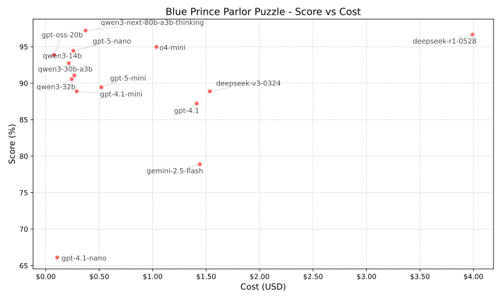

# How well can LLMs solve the _Blue Prince_ Parlor Puzzles?

This benchmark evaluates large language models (LLMs) using the sixty "parlor
puzzles" from the game _[Blue Prince]_. These puzzles require using logical
reasoning to deduce which of three boxes contains a prize. Each puzzle is
repeated three times to reduce the impact of randomness in model responses.

Puzzle texts are excerpted from _[Blue Prince]_ and remain the property of
their original copyright holder.

[Blue Prince]: https://www.blueprincegame.com/

## Leaderboard

<!-- BEGIN results -->
| Rank | Model | Score | Cost (USD) |
|------|-------|-------|------------|
| 1 | `deepseek-r1-0528` | 97% (174/180) | $3.99 |
| 2 | `o4-mini` | 95% (170/179) | $1.04 |
| 3 | `qwen3-14b` | 93% (166/179) | $0.22 |
| 4 | `qwen3-30b-a3b` | 91% (163/179) | $0.27 |
| 5 | `qwen3-32b` | 91% (163/180) | $0.24 |
| 6 | `gpt-4.1-mini` | 89% (160/180) | $0.29 |
| 7 | `deepseek-v3-0324` | 89% (160/180) | $1.53 |
| 8 | `gpt-4.1` | 87% (157/180) | $1.41 |
| 9 | `gpt-4.1-nano` | 66% (119/180) | $0.11 |
<!-- END results -->

## Example

Let's play a logic puzzle.

The rules are:

* You are in the parlor.
* The room contains a blue box, a white box, and a black box.
* The blue box is on the left, the white box is in the middle, and the black box is on the right.
* Each box displays a statement on its lid.
* There will always be at least one box which displays a true statement.
* There will always be at least one box which displays a false statement.
* Exactly one box contains gems; the other 2 are empty.
* The room also contains a wind-up key.

The three boxes display these statements:

* blue box: Only one box is true
* white box: Only one box contains the gems
* black box: The gems are in the white box

Which box contains the gems?

Think step-by-step before writing your answer in exactly this format: `<solution>white</solution>`.

## Usage

Python and [uv](https://docs.astral.sh/uv/) are required.

Define the environment variables required by model providers:

    export OPENROUTER_API_KEY=...
    export AZURE_API_BASE=...
    export AZURE_API_KEY=...

Benchmark a model using its name defined in `models.yaml`:

    uv run bench.py gpt-4.1-nano

Render updated `README.md` plot and leaderboard:

    uv run render.py
